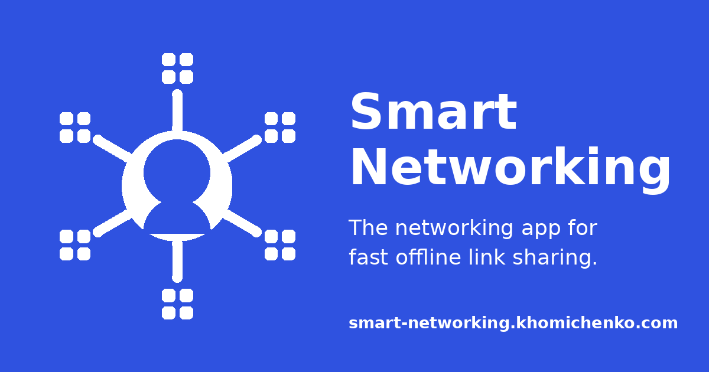

# Smart Networking

The networking app for fast offline link sharing. Online, sharing a link takes one click — offline it falls apart. Smart Networking keeps every link you own in one place, each one a QR code with one-tap copy.

**Live demo:** https://smart-networking.khomichenko.com



## The Problem

It's not just conferences. It's every "oh, send me that link" moment:

- You meet someone new — a meetup, a party, a random street conversation. Not everyone is on LinkedIn, so contact exchange turns into app-juggling.
- You mention your book, your latest article, your podcast, your product launch — and promise to "send the link later." You won't. Neither will they ask twice.
- You keep dozens of profiles across platforms, and the one you need is never the one you can find quickly.

## The Solution — two jobs, one page

**1. Swap contacts in seconds, anywhere.** Ask "where are you?" and show the right QR — LinkedIn for business, Instagram or TikTok for everyone else. They scan, you're connected.

**2. Your offline vault for every link you own.** Your products, your projects, your contacts — one organized place. Someone says "send me that"? Don't send it. Show it, they scan it — or copy the link into any chat with one tap.

## Features

- **QR code for every link** — tap a card, show a large scannable code.
- **One-tap copy** — every link is also a text link; copy it into any chat instantly.
- **Pinned favorites** — up to 5 links always on top; re-pin in two taps as your context changes.
- **Tabs** — organize links into Business / Personal / Hobby (rename them however you like).
- **Built-in editor** — open the demo, tap Edit, make it yours. Saved only in your browser; your data never leaves your device.
- **28 icons** — brands plus generic glyphs for any custom link.
- **A real app feel, no App Store** — installs on iOS & Android straight from the browser: home screen icon, full-screen, always up to date.
- **Works offline** — QR codes are generated on-device, so everything scans even with zero connection.
- **No login, no backend, no database** — a static page, deployed for free.

## Try It

1. Open the demo on your phone.
2. Tap any card and scan the QR code with another phone.
3. Tap the star on any card — it jumps to your pinned row.
4. Tap **Edit** to replace the demo profile with your own — it stays on your device.
5. Add the page to your home screen for the full app experience.

## Run Your Own

```bash
git clone https://github.com/volodymyr-khomichenko/smart-networking
cd smart-networking
npm install
npm run dev
```

To make a permanent card with your own data, edit `src/data/profile.ts` (name, title, bio, tabs, links, favorites), then deploy:

1. Push the repository to GitHub.
2. Import it at [vercel.com/new](https://vercel.com/new) — Next.js is detected automatically.
3. Every `git push` redeploys the site.

## Tech Stack

Next.js (App Router) · React · TypeScript · Tailwind CSS v4 · qrcode.react · Vercel

## About

A small AI-assisted side project built by a marketing leader to solve a real everyday problem.

Made by [Volodymyr Khomichenko](https://khomichenko.com/) — Tech B2B Marketing Strategist & Author.
